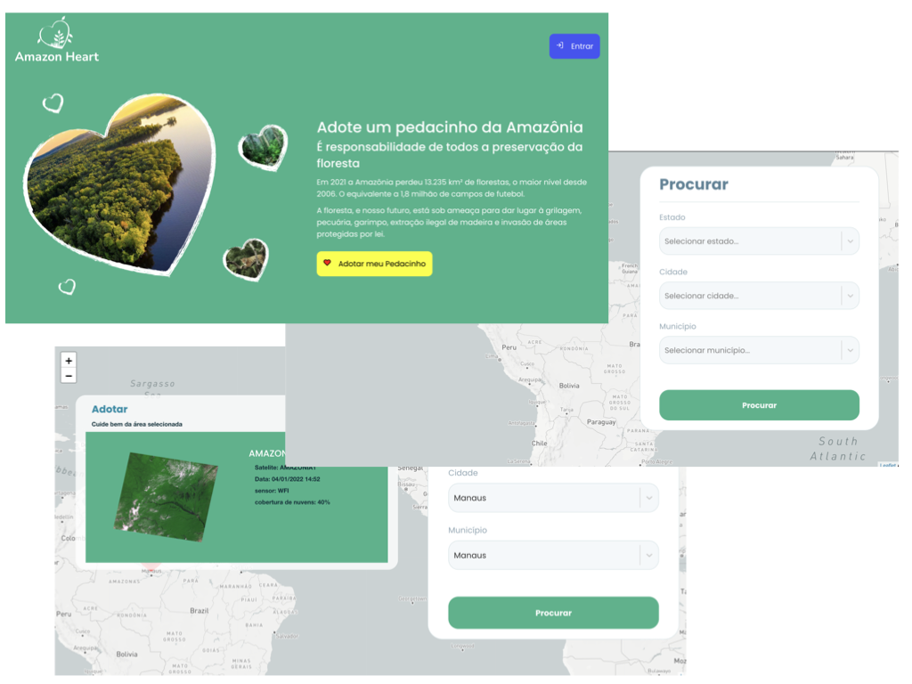

<h3 align="center">
  Amazon Heart
</h3>

<p align="left">
Cada pessoa fica responsável pelo monitoramento de um pedacinho da Amazonia
dividindo responsabilidade para preservação da floresta (prevenção contra desmatamento, queimadas, etc…)

O objetivo é que cada pessoa selecione no mapa uma área e cuide do pedacinho adotado usando imagens dos satelites do INPE (AMAZONIA*, CBERS*) e denunciando emitindo um alerta aos órgãos competentes.

Fiquei horas pensando em um nome:
* Todos pela Amazônia
* Coração da Floresta
* Meu Pedacinho amazônico
* Meu pedacinho da floresta
* Adote um pedacinho da Amazônia
* Coração Amazônia
* amazon heart
* Salve Amazonia
* Guardiões da floresta

Admito nomes não é meu forte!
</p>

<p align="center">

  

  <a target="_blank"  href ="https://github.com/jeanbarbosa/amazon-heart/stargazers">
    
  </a>
</p>

<p align="center">
  <a target="_blank"  href ="#Classroom">Sobre</a>&nbsp;&nbsp;&nbsp;|&nbsp;&nbsp;&nbsp;
  <a target="_blank"  href ="#information_source-how-to-use">Instalação</a>&nbsp;&nbsp;&nbsp;|&nbsp;&nbsp;&nbsp;
  <a target="_blank"  href ="#tech">Tecnologias usadas</a>
  <a target="_blank"  href ="#memo-license">Licença</a>
</p>

# Amazon Heart
Amazon Heart

## :information_source: How To Use

```bash

# Clone repository:
$ git clone https://github.com/JeanBarbosa/amazon-heart.git && cd amazon-heart

# Install dependencies API
$ cd api && yarn install
$ cp .env.example .env
$ node ace serve --watch

# Install dependencies WEB
$ cd web && yarn install
$ yarn start

```
## :information_source: Tecnologias usadas

### Front end
Reactjs

### Back end
Adonisjs v5

### Banco de dados
Sqlite3

### Mapa
leaflet
mapbox

### Satelites
  INPE - Instituto Nacional de Pesquisas Espaciais

Obs: Foi usado sqlite e comitado o banco para facilitar os testes mas poderia se usado qualquer instacia...

## :memo: License
This project is under the MIT license. See the [LICENSE](https://github.com/jeanbarbosa/amazon-heart/blob/master/LICENSE) for more information.
